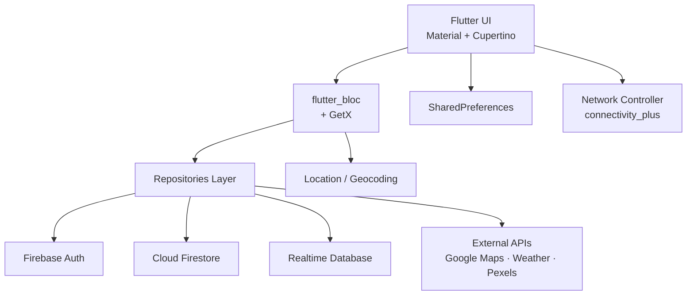

# 🌍 Travel App

> Flutter travel planning app for Android — Firebase Auth + Firestore + Realtime DB + BLoC state management, with maps / weather / directions / destination imagery APIs.

[](https://flutter.dev)
[](https://dart.dev)
[](https://firebase.google.com)
[](#-setup)
[](LICENSE)
[](https://pub.dev/packages/flutter_bloc)

---

## 📸 Demo

> Emulator screenshots will be added later. Drop files into `docs/screenshots/` and reference them here when ready.

---

## 🏗️ Architecture



**Layers**: `UI` → `BLoC` → `Repositories` → `Firebase` / `External APIs` / `Device services`.

---

## ✨ Features

- 🔐 **Auth**: Email/password + Google sign-in, email verification, password reset
- 🏠 **Home, Search, Favorites, Profile, Trip navigation**
- 🗺️ **Trip planning**: trip creation, trip detail, place list & detail, reviews, favorites
- 🌦️ **Weather, directions, maps, random destination images** (Google Maps, Weather, Pexels APIs)
- 🧪 **Local Firebase Emulator** for dev & repository tests
- 📡 **Network awareness** via `connectivity_plus`
- 💾 **Local cache** via `shared_preferences`
- Place lists, place detail pages, reviews, and favorites
- Weather, directions, maps, and random destination images
- Local Firebase Emulator setup for development and repository tests

## Tech Stack

- Flutter / Dart
- Firebase Core, Auth, Firestore, and Realtime Database
- flutter_bloc and GetX
- Firebase Emulator Suite
- Android Gradle project

## Requirements

- Flutter SDK compatible with Dart `^3.8.1`
- Android Studio or Android SDK tooling
- Firebase CLI for local emulator development

Verify the local toolchain:

```powershell
flutter doctor
firebase --version
```

## Setup

Install dependencies:

```powershell
flutter pub get
```

Create an optional `.env` file in the repository root for external API integrations:

```dotenv
GOOGLE_MAPS_API_KEY=
azureApiKey=
pexelsApiKey=
```

The app loads `.env` with `isOptional: true`, so the project can still start without these values. Some API-backed features will fall back or return limited results when keys are missing.

## Firebase Emulator

The recovery development project id is:

```text
travel-app-v2-dev
```

Start the local emulators from the repository root:

```powershell
firebase emulators:start --project travel-app-v2-dev
```

In another terminal, seed Firestore:

```powershell
powershell -ExecutionPolicy Bypass -File tool\seed_firestore_emulator.ps1
```

Default emulator ports:

| Service | Port |
| --- | --- |
| Auth | `9099` |
| Firestore | `8080` |
| Realtime Database | `9000` |
| Emulator UI | `4000` |

See [docs/firebase-emulator.md](docs/firebase-emulator.md) for more detail.

## Run

Start the Firebase Emulator first, then run the Flutter app:

```powershell
flutter run -d emulator
```

Android emulator builds connect to the host machine through `10.0.2.2`, which is already reflected in the development Firebase options.

## Test

Run static analysis:

```powershell
flutter analyze
```

Run repository tests:

```powershell
flutter test test\repositories
```

## Build

Build a debug APK:

```powershell
flutter build apk --debug
```

## Firebase Production Setup

For a real Firebase project, create an Android app with package:

```text
com.example.travel_app_v2
```

Then download `android/app/google-services.json`, run FlutterFire configuration, and replace the placeholder development options in `lib/repositories/firebase_options.dart` with generated project options.

More recovery notes are available in [docs/android-recovery.md](docs/android-recovery.md).

---

## 📦 Tech Stack

| Layer | Technology |
|---|---|
| UI | Flutter (Material + Cupertino), `google_fonts`, `lottie` |
| State | `flutter_bloc` 9.x + `get` 4.7 |
| Backend | Firebase Auth, Cloud Firestore, Realtime Database |
| Maps | `syncfusion_flutter_maps`, `location`, `geocoding` |
| Media | `image_picker`, Pexels API (random destination images) |
| UX helpers | `loading_animation_widget`, `flutter_rating_bar`, `colorful_safe_area` |
| Dev | Firebase Emulator, `fake_cloud_firestore`, `firebase_auth_mocks` |

---

## 🤝 Contributing

See [CONTRIBUTING.md](CONTRIBUTING.md). Bug reports → use the issue templates in `.github/ISSUE_TEMPLATE/`.

## 🔒 Security

See [SECURITY.md](SECURITY.md). **Do not** commit `google-services.json` with real keys.

## 📝 Changelog

See [CHANGELOG.md](CHANGELOG.md).

## 📄 License

MIT — see [LICENSE](LICENSE).
